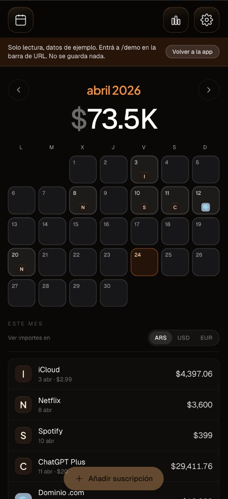
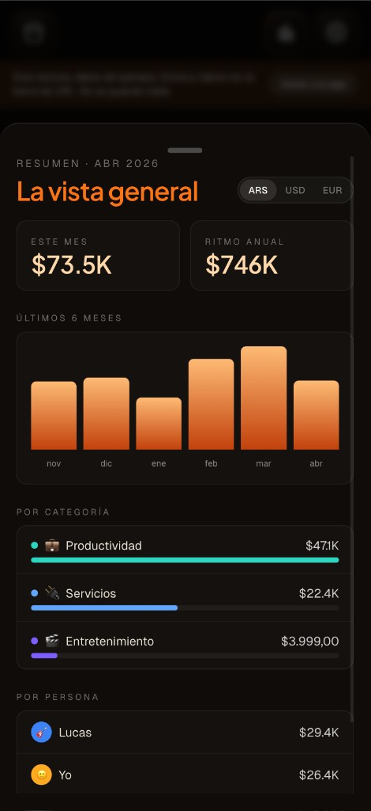
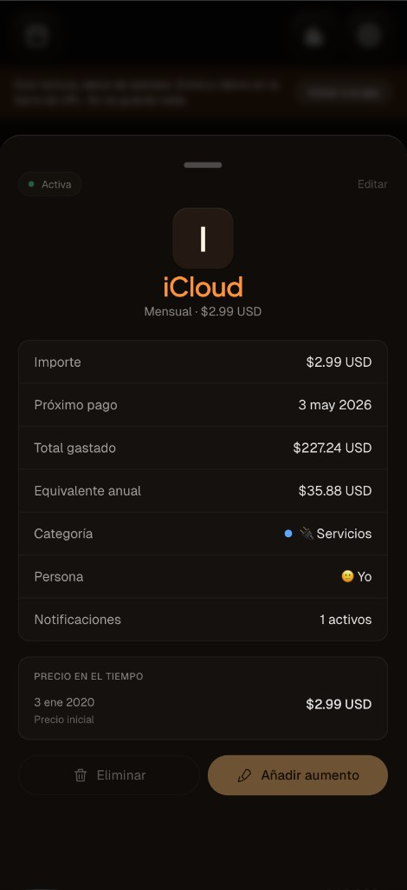
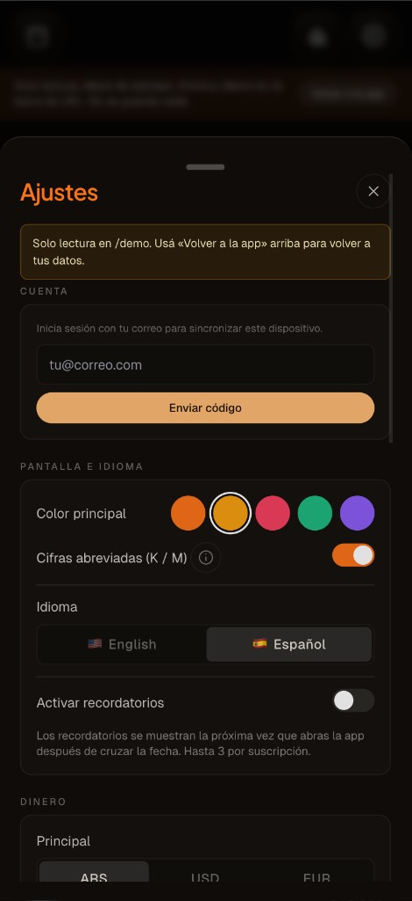

# Gastitos

A subscription tracker in the browser: month calendar with logos, totals, metrics, ARS / USD / EUR, people & categories, optional Supabase sync. Installable as a **PWA**; data stays on the device (IndexedDB).

**[Live app](https://afranchetti-gastitos.vercel.app/)**

## Screenshots

<p align="center">
  
  
  
  
</p>

## Features

- Calendar ([logo.dev](https://www.logo.dev)), monthly total, price raises with a clear timeline
- Metrics: last 6 months, breakdown by category and person
- Local reminders (up to 3 per subscription), optional fixed payment count

## Run from source

```bash
npm install
npm run dev
```

Open `http://localhost:5173`.

**Optional sync:** Supabase project + run `supabase/schema.sql` + `VITE_SUPABASE_*` in `.env` (see `.env.example`), then sign in under Settings → Account with email OTP ([Supabase docs](https://supabase.com/docs/guides/auth/auth-email-passwordless#with-otp)).

```bash
npm run build
npm run typecheck
```

Pricing model: `src/lib/types.ts` (`raises`, `priceOn()`).
